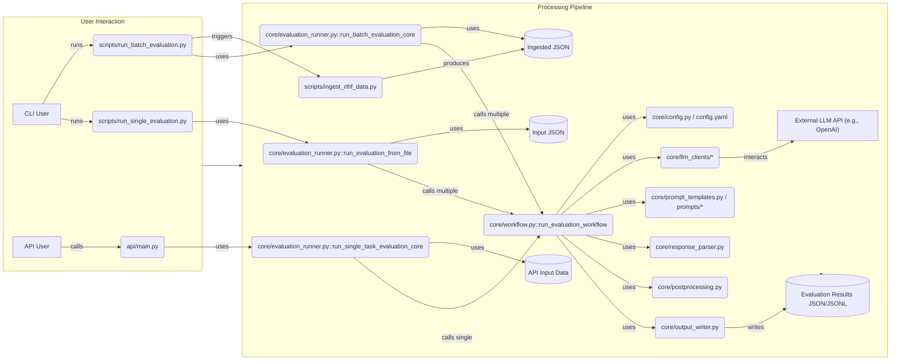

## Backend Architecture

This document outlines the backend architecture of the CogniBench project, focusing on the components responsible for orchestrating and executing Large Language Model (LLM) evaluations. The backend is primarily composed of three main parts: a core evaluation library, a set of operational scripts, and an optional API layer.



### Core Library (`CogniBench/core/`)

The `core/` directory contains the central logic for the evaluation process.

* **`workflow.py`**: Defines the `run_evaluation_workflow` function, which executes the evaluation steps for a *single* task instance (i.e., one model's response to one prompt).
* **`evaluation_runner.py`**: Provides higher-level functions to manage evaluation runs (`run_single_task_evaluation_core`, `run_batch_evaluation_core`).
* **`llm_clients/`**: Contains the interface for interacting with LLMs (`base.py`, `openai_client.py`).
* **`config.py`**: Defines Pydantic models (`AppConfig`) for loading `config.yaml`.
* **`response_parser.py`**: Contains `parse_judge_response` for extracting structured data from the judge LLM's raw output.
* **`preprocessing.py`**: Includes utility functions like `normalize_text_formats`.
* **`postprocessing.py`**: Implements `perform_postprocessing` for final answer verification, score aggregation, and review flagging.
* **`output_writer.py`**: Handles saving evaluation results (`save_evaluation_result`) to JSONL files.
* **`prompt_templates.py`**: Provides `load_prompt_template`.
* **Other Files**: `constants.py`, `log_setup.py`, `schemas/`.

#### Key Function Contracts (Core)

* **`run_evaluation_workflow` (`workflow.py`)**
  * **Purpose:** Executes the complete evaluation pipeline for a single task instance (one prompt, one model response, one ideal response). This involves structuring the model's response and the ideal response using an LLM, preparing a prompt for a "judge" LLM, invoking the judge LLM, parsing the judge's response, performing post-processing (like final answer verification and score aggregation), and saving the detailed results to a JSONL file. Handles retries and caching for structured ideal responses.
  * **Inputs:** `prompt` (str), `response` (Any), `ideal_response` (Any), `correct_answer` (str), `config` (AppConfig), `task_id` (Optional[str]), `model_id` (Optional[str]), `llm_client` (Optional[BaseLLMClient]), `output_jsonl_path` (Optional[Path]), `structured_ideal_cache` (Optional[Dict]).
  * **Outputs:** (Dict[str, Any]) - Dictionary indicating success/error status and the evaluation ID.

* **`run_single_task_evaluation_core` (`evaluation_runner.py`)**
  * **Purpose:** Processes a single task dictionary, which might contain multiple model responses for the same prompt. Extracts necessary data (prompt, ideal, model responses, correct answer) handling different input formats (RLHF vs. ingested). Calls `run_evaluation_workflow` for each model response within the task. Manages ideal response structuring cache and cancellation signals.
  * **Inputs:** `task_index` (int), `task_data` (Dict[str, Any]), `config` (AppConfig), `use_structured` (bool), `output_jsonl_path` (Optional[Path]), `structured_ideal_cache` (Optional[Dict]), `stop_event` (Optional[threading.Event]).
  * **Outputs:** (Tuple[List[Dict], bool]) - A list of results from `run_evaluation_workflow` calls and a boolean indicating task success/failure.

* **`run_batch_evaluation_core` (`evaluation_runner.py`)**
  * **Purpose:** Orchestrates evaluation for multiple tasks defined across one or more input JSON files. Iterates through files, loads tasks, calls `run_single_task_evaluation_core` for each task. Manages output file creation (`_evaluations.jsonl`, `_final_results.json`) within a batch-specific directory. Aggregates results into the final report. Supports cancellation.
  * **Inputs:** `config` (AppConfig), `output_dir` (Path), `use_structured` (bool), `stop_event` (Optional[threading.Event]).
  * **Outputs:** (Optional[List[str]]) - List of paths to generated `_final_results.json` files on success, `None` on failure/cancellation.

* **`parse_judge_response` (`response_parser.py`)**
  * **Purpose:** Parses the raw string output from the "judge" LLM. Extracts a JSON block (handling markdown fences), parses it (with `json5` fallback), validates its structure (requires `evaluation` key), and validates the content within `evaluation` against expected criteria and allowed scores from the config.
  * **Inputs:** `raw_response_content` (str), `expected_criteria` (List[str]), `allowed_scores` (List[str]).
  * **Outputs:** (Dict[str, Any]) - On success, the original parsed dictionary but with the `evaluation` key replaced by validated content. On failure, `{'error': str}`.

* **`perform_postprocessing` (`postprocessing.py`)**
  * **Purpose:** Orchestrates post-evaluation steps. Extracts the model's final answer from its structured response, verifies it against the correct answer (using SymPy if available), aggregates rubric scores into an overall score (Pass/Fail/Partial) based on config rules, and flags evaluations for human review based on verification results, aggregation issues, or parsing errors.
  * **Inputs:** `parsed_judge_response` (Dict), `structured_model_response_obj` (Optional[Dict]), `correct_final_answer` (Optional[str]), `config` (AppConfig).
  * **Outputs:** (Dict[str, Any]) - Dictionary containing `final_answer_verified` (Optional[bool]), `verification_message` (str), `aggregated_score` (Literal["Pass", "Fail", "Partial"]), `needs_human_review` (bool), `review_reasons` (List[str]).

### API Layer (`CogniBench/api/`)

* **`main.py`**: FastAPI application defining endpoints:
  * `/health`: Basic health check.
  * `/submit_evaluation`: Accepts a single evaluation task (prompt, model response, ideal response, etc.) via POST request, validates it, and queues it for processing by `run_single_task_evaluation_core`. Returns a submission status and evaluation ID.
  * `/get_evaluation_result/{evaluation_id}`: Retrieves the detailed results of a previously submitted evaluation using its ID via GET request.
* **`schemas.py`**: Pydantic models defining the structure for API requests (`EvaluationRequest`) and responses (`EvaluationResponse`, `EvaluationResultData`).

### Scripts (`CogniBench/scripts/`)

* **`run_batch_evaluation.py`**: Command-line interface for end-to-end batch processing. Takes configuration, triggers ingestion (if needed), runs `run_batch_evaluation_core`, and handles output directory creation.
* **`run_single_evaluation.py`**: CLI for running evaluation on a *single pre-ingested* JSON file (containing potentially multiple tasks). Useful for rerunning evaluations without full batch setup.
* **`ingest_rlhf_data.py`**: Preprocesses raw RLHF JSON data into the format expected by the evaluation runners. Extracts key fields, performs basic transformations (e.g., boolean conversion), and saves the output.
* **`run_structuring.py`**: Runs *only* the structuring step of the workflow on input data. Useful for debugging or pre-calculating structured representations.
* **`review_flagged_evals.py`**: A utility tool (likely interactive) for reviewing evaluations that were flagged as needing human attention during postprocessing.
* **`show_evaluation_data.py`**: A utility tool for displaying evaluation results stored in output files in a user-friendly format.

#### Key Function Contracts (Scripts)

* **`ingest_rlhf_data` (`ingest_rlhf_data.py`)**
  * **Purpose:** Loads raw RLHF JSON data from input files. Extracts relevant fields (task ID, prompt, ideal response, model responses, metadata, human evals, final answer). Performs transformations (e.g., boolean conversion for Yes/No scores) and standardizes the structure. Saves the combined, processed data into a single timestamped JSON file suitable for evaluation runners.
  * **Inputs:** `input_paths` (List[Path]), `output_path` (Path).
  * **Outputs:** (None) - Writes the ingested data to `output_path` and prints the path to stdout.

### Configuration (`config.yaml` & `core/config.py`)

* **`config.yaml`**: Central configuration file defining settings for:
  * LLM clients (API keys, default models for structuring/judging).
  * Input/Output paths.
  * Evaluation settings (judge model, prompt template path, expected criteria, allowed scores).
  * Structuring settings (structuring model, prompt template path).
  * Aggregation rules (e.g., fail if any 'No' score).
  * Consistency checks (e.g., trivial justification length).
* **`core/config.py`**: Defines Pydantic models (e.g., `AppConfig`, `LLMClientConfig`, `EvaluationSettings`) used to load, validate, and access the settings from `config.yaml` in a type-safe manner.

### Data Structures and Examples

This section illustrates the structure of key data objects used throughout the pipeline.

#### 1. Raw Input JSON (Example for `ingest_rlhf_data.py`)

*Source: `CogniBench/tests/scripts/test_data/valid_input.json`*

```json
{
  "rlhf": [
    {
      "taskId": 101,
      "messages": [
        {
          "role": "user",
          "text": "User prompt 1",
          "prompt_evaluation": [
            {"question": "Subject", "human_input_value": "Algebra"},
            {"question": "Complexity", "human_input_value": "Basic"}
          ]
        },
        {
          "role": "assistant",
          "response_options": [
            {"model_id": "model_a", "text": "Response A"}
          ],
          "signal": {
            "ideal_response": "Ideal 1",
            "human_evals": [
              {
                "model_id": "model_a",
                "evaluation_form": [
                  {"question": "Model Failure", "human_input_value": "No"},
                  {"question": "Failure Comments", "human_input_value": "Looks good."}
                ]
              }
            ],
            "raw_preference_evaluation_form": [ // Example: May contain final answer
              {"question": "Final Answer", "human_input_value": "\\(60\\)"}
            ]
          }
        }
      ]
    }
  ]
}
```

#### 2. Ingested JSON (Example Output of `ingest_rlhf_data.py`)

*Source: `Batch-001_20250412_0427/Batch-001_ingested_20250412_0427.json` (showing one task)*

```json
[
  {
    "task_id": 5500,
    "prompt": "Find the next number of the sequence 9,5,6,10.5,23.",
    "ideal_response": "To solve this step by step...", // Full ideal response text
    "final_answer": "\\(60\\)", // Extracted from raw_preference_evaluation_form
    "model_responses": [
      {
        "model_id": "o1",
        "response_text": "A succinct way to see why the next term is 54..." // Full response text
      },
      // ... other model responses for the same task
    ],
    "human_evaluations": [ // Transformed human evals
      {
        "model_id": "o1",
        "model_failure": true, // Boolean conversion
        "failure_comments": "The model had wrongly assumed..."
      },
      // ... other human evaluations
    ],
    "metadata": {
      "subject": "Algebra",
      "complexity": "Intermediate",
      "system_prompt": "For exact-match questions..." // Full system prompt text
    }
  }
  // ... other ingested tasks
]
```

#### 3. Raw Judge LLM Output (Example Input to `parse_judge_response`)

*Based on test cases in `response_parser.py`*

```
Some introductory text from the LLM.
```json
{
    "evaluation": {
        "Problem Understanding": {
            "score": "Yes",
            "justification": "Model correctly identified the integral.",
            "confidence": 0.9
        },
        "Results Formulae": {
            "Score": "no",
            "Justification": "Final answer was incorrect."
        },
        "Assumptions": {
            "score": "Partial",
            "justification": "Some assumptions were missed."
        }
    },
    "overall_comment": "Good start, but calculation error."
}
```

Some concluding text.

#### 4. Single Task Evaluation Result (Example Line in `_evaluations.jsonl`)

*Source: `Batch-001_20250412_0427/Batch-001_evaluations.jsonl`*

```json
{"evaluation_id": "eval_796c7caa-f92a-4ea0-9ef4-e2482362d162", "task_id": 5500, "model_id": "o1", "response_id": null, "ideal_response_id": null, "judge_llm_model": "o1", "judge_prompt_template_path": "prompts/Math-L1-v1.0-robust.txt", "raw_judge_output": {"raw_content": "```json\n{\n  \"evaluation\": {\n    \"Problem Understanding\": {\n      \"score\": \"Yes\",\n      \"justification\": \"...\"\n    },\n    ...\n  }\n}\n```"}, "parsed_rubric_scores": {"Rigor and Completeness": {"score": "Yes", "justification": "..."}, "Logical Implications": {"score": "Yes", "justification": "..."}, ...}, "aggregated_score": "Fail", "final_answer_verified": null, "verification_message": "Verification skipped: Extracted answer was None.", "needs_human_review": false, "review_reasons": [], "parsing_error": null, "human_review_status": "Not Required", "human_reviewer_id": null, "human_review_timestamp": null, "human_corrected_scores": null, "human_review_comments": null, "created_at": "2025-04-11T22:57:58.056959Z"}
```

#### 5. Aggregated Final Results (Example Structure of `_final_results.json`)

*Source: `CogniBench/data/Batch-003_Batch-004_20250416_1813/Batch-003_Batch-004_20250416_1813_final_results.json`*

```json
{
  "summary": {
    "batch_id": "Batch-003_Batch-004_20250416_1813",
    "total_tasks_processed": 199,
    "total_evaluations_processed": 983,
    // ... other summary stats ...
    "models_evaluated": [
      "claude-3-5-sonnet-latest",
      "deepseek-v3",
      "gpt-4o",
      "o1",
      "o1-mini"
    ]
  },
  "results": [
    {
      "task_id": 5555,
      "prompt": "Let \\(A\\) be a subset of \\(\\mathbb{R}^3\\) ...",
      "ideal_response": "\\nWe need to construct a subset \\( A \\) ...",
      "final_answer": "\\(Uncountable\\)",
      "metadata": {
        "subject": "Linear Algebra",
        "complexity": "Intermediate",
        "turing_task_url": "https://rlhf-v3.turing.com/prompt/..."
      },
      "structured_ideal_response": { // Added structure for ideal response
        "model": "gpt-4o",
        "response": {
          "assumptions": "",
          "steps": [
            "Step 1: Construct the subset A = {(1, t, t^2) | t ∈ ℝ} of ℝ^3.",
            // ... other steps ...
          ],
          "intermediate_results": [
            "Matrix determinant: det = (t2 - t1)(t3 - t1)(t3 - t2)"
          ],
          "final_answer": "The maximum possible Cardinality of A ... is uncountable.",
          "format_notes": "Answer is boxed in LaTeX"
        }
      },
      "evaluations": [ // List of evaluations for this task_id
        {
          "model_id": "o1",
          "model_response": "First, let us restate the problem carefully:...",
          "structured_model_response": { // Added structure for model response
             "model": "gpt-4o",
             "response": {
               "assumptions": "A is a subset of ℝ³ ...",
               "steps": [
                 "Step 1: Reformulate the condition ...",
                 // ... other steps ...
               ],
               "intermediate_results": [
                 "No three points of A can lie in the same 2-dimensional subspace ...",
                 // ... other results ...
               ],
               "final_answer": "The maximum possible cardinality of A is infinite.",
               "format_notes": ""
             }
          },
          "human_evaluation": { // Original human evaluation data
            "model_failure": false,
            "failure_comments": "The answer is correct."
          },
          "judge_evaluation": { // Detailed judge results from JSONL
            "judge_llm_model": "gpt-4o",
            "judge_prompt_template_path": "prompts/judging/Math-L1-Judging-v1.0.txt",
            "parsed_rubric_scores": {
              "results_formulae": { "score": "Partial", "justification": "..." },
              "rigor_and_completeness": { "score": "Partial", "justification": "..." },
              "problem_understanding": { "score": "Yes", "justification": "..." },
              "assumptions": { "score": "Yes", "justification": "..." }
              // ... other criteria ...
            },
            "aggregated_score": "Partial", // Example score
            "final_answer_verified": true, // Example verification
            "verification_message": "Final answer matches.", // Example message
            "needs_human_review": false,
            // ... other judge fields from JSONL ...
            "created_at": "..." // Timestamp
          }
        },
        // ... evaluation object for other models (o1-mini, gpt-4o, etc.) for task_id 5555
      ]
    }
    // ... other task objects in the 'results' array
  ]
}
```

#### 6. API Request/Response Examples

* **`/submit_evaluation` Request Body:**

    ```json
    {
      "prompt_id": "math_seq_001",
      "prompt_content": "Find the next number of the sequence 9, 5, 6, 10.5, 23.",
      "prompt_metadata": { "subject": "Algebra", "complexity": "Intermediate" },
      "model_response_id": "resp_o1_task5500_run1",
      "model_name": "o1",
      "model_response_text": "A succinct way to see why the next term is 54...",
      "ideal_response_id": "ideal_math_seq_001",
      "ideal_response_text": "To solve this step by step...",
      "correct_answer": "\\(60\\)",
      "judge_llm_model": "o1", // Optional override
      "judge_prompt_version": "Math-L1-v1.0-robust.txt" // Optional override
    }
    ```

* **`/submit_evaluation` Success Response Body:**

    ```json
    {
      "status": "submitted",
      "message": "Evaluation task accepted and queued.",
      "evaluation_id": "eval_796c7caa-f92a-4ea0-9ef4-e2482362d162"
    }
    ```

* **`/get_evaluation_result/{evaluation_id}` Response Body:** (Structure mirrors the JSONL line)

    ```json
    {
      "evaluation_id": "eval_796c7caa-f92a-4ea0-9ef4-e2482362d162",
      "response_id": "resp_o1_task5500_run1",
      "ideal_response_id": "ideal_math_seq_001",
      "judge_llm_model": "o1",
      "judge_prompt_template_version": "prompts/Math-L1-v1.0-robust.txt",
      "raw_judge_output": { "raw_content": "```json...```" },
      "parsed_rubric_scores": { "...": { "score": "...", "justification": "..." } },
      "aggregated_score": "Fail",
      "final_answer_verified": null,
      "verification_message": "Verification skipped: Extracted answer was None.",
      "needs_human_review": false,
      "review_reasons": [],
      "parsing_error": null,
      "human_review_status": "Not Required",
      // ... other fields ...
      "created_at": "2025-04-11T22:57:58.056959Z"
    }
    ```

### Batch Output Folder and File Structure

When `scripts/run_batch_evaluation.py` is executed, it creates a dedicated, timestamped output directory within the main `CogniBench/data/` directory. The name of this output directory is typically based on the input batch name(s) and the execution timestamp (e.g., `Batch-XXX_YYYYMMDD_HHMM/` or `Batch-003_Batch-004_YYYYMMDD_HHMM/`).

Within this generated output directory, the following key intermediate and final result files are saved:

```
CogniBench/
└── data/
    └── Batch-XXX_YYYYMMDD_HHMM/  <-- Timestamped Output Directory
        ├── Batch-XXX_ingested_YYYYMMDD_HHMM.json  (Optional: Preprocessed input)
        ├── Batch-XXX_evaluations.jsonl            (Detailed results per evaluation)
        ├── Batch-XXX_evaluations_formatted.json   (Optional: Prettified JSONL)
        └── Batch-XXX_final_results.json           (Final aggregated results)
```

*   **`Batch-XXX_ingested_YYYYMMDD_HHMM.json`**: (Optional, created if ingestion is run as part of the batch script) The result of preprocessing the raw input JSON (e.g., `Task_JSONs/Batch-XXX.json`) via `scripts/ingest_rlhf_data.py`. This file contains the standardized task data consumed by the evaluation core.
*   **`Batch-XXX_evaluations.jsonl`**: Contains the detailed, raw evaluation results for *each individual model response* evaluated within the batch, written line-by-line in JSON Lines format. Each line corresponds to the output of `core/output_writer.py::save_evaluation_result`. This is the primary log of individual evaluation outcomes.
*   **`Batch-XXX_evaluations_formatted.json`**: (Optional, generated by `run_batch_evaluation.py` after the core processing) A prettified JSON version of the `_evaluations.jsonl` file, often used for easier manual inspection.
*   **`Batch-XXX_final_results.json`**: The final aggregated results file for the input batch (`Batch-XXX.json`). It groups the detailed evaluations from the JSONL file by `task_id` and includes the original prompt, ideal response, metadata, structured responses, and a list of evaluations (one per model response), combining the model's response text with the corresponding judge evaluation details. This file is typically used for analysis and reporting.

### Data Flow Summary

* **Batch Evaluation (CLI):** Raw Input JSON -> `ingest_rlhf_data.py` -> Ingested JSON -> `run_batch_evaluation_core` -> (Loop over tasks) `run_single_task_evaluation_core` -> (Loop over models) `run_evaluation_workflow` -> Append to `_evaluations.jsonl` -> Aggregate into `_final_results.json`.
* **Single Evaluation (API):** API Call (`EvaluationRequest`) -> `run_single_task_evaluation_core` -> `run_evaluation_workflow` -> Append to `_evaluations.jsonl` -> API Response (`EvaluationResponse`) -> Later GET `/get_evaluation_result/{id}` retrieves data similar to JSONL line.

### Key Technologies

* Python, FastAPI, Uvicorn, OpenAI lib, PyYAML, Pydantic, python-dotenv, TQDM, SymPy, ANTLR, Pytest, Ruff.
