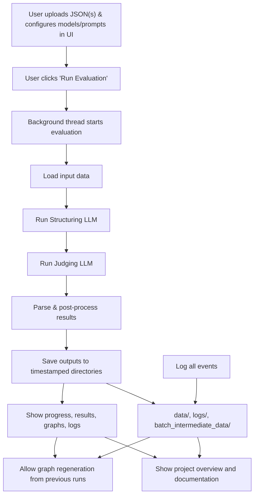

# ⚖️ CogniBench: LLM-as-a-Judge System Architecture for Advanced Math & STE Evaluation 🔍

## 1. Introduction & Goals

* **Purpose:** CogniBench is an automated system for evaluating the quality of Large Language Model (LLM) responses to advanced mathematics and STEM prompts.
* **Core Function:** The system ingests data containing a `PROMPT`, `MODEL RESPONSE`s (with step-by-step reasoning), an `IDEAL RESPONSE` (expert-written), and a ground-truth `FINAL_ANSWER`. It uses a configurable Judge LLM and prompt template to evaluate each `MODEL RESPONSE` against a predefined rubric (e.g., the L1 rubric), assessing correctness, rigor, and logical soundness. It outputs detailed, structured evaluation results.
* **Scope:** Focused on the evaluation (`Judge`) component, operating on data preprocessed by `ingest_rlhf_data.py`. Implements L1 diagnostic analysis.
* **Target Users:** Internal R&D teams, with potential for client reporting verification.
* **Key Challenges:** Ensuring consistent and accurate application of nuanced rubrics by the Judge LLM, robust parsing of judge outputs, and accurate verification of complex answers (especially mathematical).

---

## 2. Key Concepts

* **PROMPT:** The original advanced math/STEM problem.
* **MODEL RESPONSE:** The LLM-generated solution, including reasoning steps and a final answer.
* **IDEAL RESPONSE:** The expert-provided, step-by-step correct solution methodology.
* **FINAL_ANSWER:** The ground-truth final answer to the prompt, extracted from human annotations during ingestion.
* **CogniBench:** The system being designed; it leverages a powerful LLM (the "Judge LLM") to perform the evaluation.
* **L1 Rubric Parameters:** Problem Understanding, Assumptions, Logical Implications, Results Formulae, Rigor and Completeness.
* **L2 Subcomponents:** Granular criteria under each L1 parameter.
* **Binary Evaluation (Yes/No):** Each L1 parameter (and potentially L2 subcomponent) is scored as either fully meeting the criteria (Yes) or having a flaw (No).
* **Justification:** The judge must provide reasoning for each Yes/No decision, referencing specific parts of the `MODEL RESPONSE` and `IDEAL RESPONSE`.

---

## 3. High-Level Architecture

The system follows a pipeline/workflow architecture, supporting both synchronous (UI-driven) and batch (script-driven) evaluation modes. All logs and results are organized by timestamped directories for traceability.

### Mermaid Diagram: CogniBench Workflow

### Backend

- **Direct integration with the UI** (no subprocess), using background threads for non-blocking evaluation.
- **Robust logging, error handling, and persistent results saving** in timestamped directories.
- **Flexible rubric and prompt templates**, now aligned with backend validation (including 'Logical Implications', 'final_answer', 'method', 'assumptions').
- **Batch and synchronous evaluation modes**, with scripts for batch processing and result retrieval.
- **Enhanced post-processing**, including SymPy-based answer verification and human review flagging.

### Frontend (Streamlit UI)

- **Modularized UI** with tabs for Evaluation, Results, Logs, and Project Overview.
- **File upload** supports both single and multiple JSON files, with schema validation and user feedback.
- **Configuration UI** uses forms, dynamic selectboxes, tooltips, and high-contrast tips for accessibility.
- **Results tab** displays summary, detailed tables, and interactive graphs regenerated from existing data.
- **Logs tab** shows the full backend and frontend logs from the latest run.
- **Project Overview tab** renders this documentation directly in the app.
- **All UI enhancements** from `ui_enhancement.md` have been implemented, including accessibility, error handling, and visual grouping.

---

## 4. Detailed Workflows

### 4.1 Synchronous Workflow (Streamlit UI or Batch Disabled)

1. User uploads raw JSON file(s) and configures models/prompts in the UI.
2. User clicks "Run Evaluation" to start a background evaluation thread.
3. The backend loads input data, runs structuring and judging LLMs, parses and post-processes results, and saves outputs.
4. Results, graphs, and logs are displayed in the UI tabs.
5. Users can view or regenerate graphs from previous runs, and review logs for debugging.

### 4.2 Asynchronous Batch API Workflow

1. User runs `run_batch_evaluation.py` to submit a structuring batch.
2. User waits for batch completion, then retrieves results and submits a judging batch.
3. User retrieves judging results and finalizes evaluation.
4. All intermediate and final results are saved in timestamped directories.

---

## 5. Component Breakdown

- **Input Data Intake:** Reads pre-ingested data from JSON files.
- **Preprocessing Module:** Normalizes and prepares inputs for the Judge LLM.
- **Evaluation Core:** Performs core evaluation using the Judge LLM, with robust prompt construction and output parsing.
- **Post-processing & Aggregation:** Verifies final answers (using SymPy if available), aggregates scores, and flags for human review.
- **Output Generation:** Formats and saves results in JSON/JSONL, with all keys in `snake_case`.
- **Data Storage:** All data, logs, and results are stored in organized, timestamped directories.
- **Workflow Orchestrator / Scripts:** Manages execution flow for both synchronous and batch modes.
- **API Layer (optional):** RESTful API for external integration.

---

## 6. Technology Stack

- **Programming Language:** Python
- **LLM Judge:** Configurable via `config.yaml` (e.g., GPT-4o, Claude 3 Opus, Gemini 1.5 Pro)
- **Math Verification:** `sympy` (optional dependency)
- **Configuration:** `PyYAML`
- **API Framework:** FastAPI
- **UI Framework:** Streamlit
- **Workflow Orchestration:** Python scripts
- **Data Storage:** Filesystem (JSON, JSONL)
