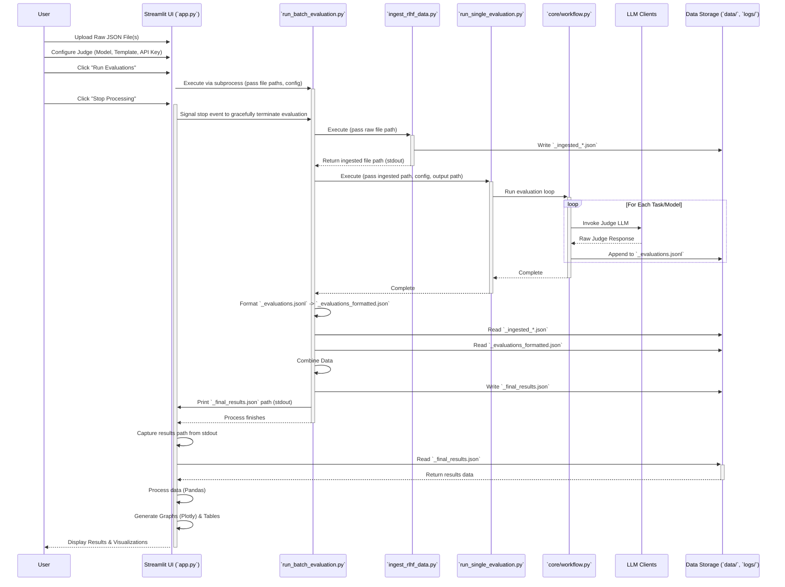

# ⚖️ CogniBench: LLM-as-a-Judge System Architecture for Advanced Math & STE Evaluation 🔍

## 1. Introduction & Goals

* **Purpose:** To create an automated system (CogniBench) that evaluates the quality of Large Language Model (LLM) responses to advanced mathematics and STEM prompts.
* **Core Function:** The system takes ingested data containing a `PROMPT`, `MODEL RESPONSE`s (including step-by-step reasoning), an `IDEAL RESPONSE` (expert-written detailed steps), and a ground-truth `FINAL_ANSWER` (extracted during ingestion from human annotations). It uses a configurable Judge LLM and prompt template to evaluate each `MODEL RESPONSE` against a predefined rubric (e.g., the L1 rubric), assessing correctness, rigor, and logical soundness. It outputs detailed, structured evaluation results.
* **Scope:** Focused on the evaluation (`Judge`) component, operating on data preprocessed by `ingest_rlhf_data.py`. Implements L1 diagnostic analysis.
* **Target Users:** Internal R&D teams, potentially adapted for client reporting verification.
* **Key Challenges:** Ensuring consistent and accurate application of nuanced rubrics by the Judge LLM, robust parsing of judge outputs, and accurate verification of complex answers (especially mathematical).

## 2. Key Concepts (from Reference Document)

* **PROMPT:** The original advanced math/STEM problem.
* **MODEL RESPONSE:** The LLM-generated solution, including reasoning steps and a final answer.
* **IDEAL RESPONSE:** The expert-provided, step-by-step correct solution methodology.
* **FINAL_ANSWER:** The ground-truth final answer to the prompt, extracted from human annotations during ingestion.
* **CogniBench:** The system being designed; it leverages a powerful LLM (the "Judge LLM") to perform the evaluation.
* **L1 Rubric Parameters:** Problem Understanding, Assumptions, Logical Implications, Results Formulae, Rigor and Completeness.
* **L2 Subcomponents:** Granular criteria under each L1 parameter.
* **Binary Evaluation (Yes/No):** Each L1 parameter (and potentially L2 subcomponent) is scored as either fully meeting the criteria (Yes) or having a flaw (No).
* **Justification:** The judge must provide reasoning for each Yes/No decision, referencing specific parts of the `MODEL RESPONSE` and `IDEAL RESPONSE`.

## 3. High-Level Architecture

The system follows a pipeline/workflow architecture:

```mermaid
graph LR

  subgraph CogniBench System
    direction LR

    %% Core Workflow Components
    A[Input Data Intake] --> B(Preprocessing: Normalization & LaTeX Conversion);
    B --> C["Evaluation Core (LLM Judge)"];
    C --> D[Post-processing & Aggregation];
    D --> E[Output Generation];

    %% Data Storage & Logging
    %% Intake reads ingested
    F["Data Storage (.json, .jsonl)"] <--> A; 
    %% Output writes results
    F <--> E; 
    %% Orchestrator writes logs
    LOG["Log Storage (.log)"] <--> G; 

    %% Orchestration & UI
    %% Script reads ingested data path
    G["Batch Script Orchestrator (`run_batch_evaluation.py`)"] -- Manages --> A; 
    %% Script calls evaluation workflow
    G -- Calls --> C; 
    %% Script combines results
    G -- Manages --> D; 
    %% Script defines output paths
    G -- Manages --> E; 
    %% UI runs the script
    I["Streamlit UI (`streamlit_app/app.py`)"] -- Triggers --> G;
    %% UI reads final_results.json
    I -- Reads Results --> F; 

    %% Evaluation Core Details
    subgraph "Evaluation Core (LLM Judge)"
        direction LR
        C1[Prompt Constructor] --> C2(Judge LLM Invocation);
        C2 --> C3[Response Parser];
    end

    %% Optional API Layer (Not used by Streamlit App)
    H[(API Layer)];

    %% Styling
    style F fill:#9575cd,stroke:#333,stroke-width:2px
    style LOG fill:#b0bec5,stroke:#333,stroke-width:1px
    style C fill:#64b5f6,stroke:#333,stroke-width:2px
    %% Dashed border for optional/unused
    style H fill:#4db6ac,stroke:#333,stroke-width:1px,stroke-dasharray: 5 5
    style G fill:#ffca28,stroke:#333,stroke-width:2px
    style I fill:#a5d6a7,stroke:#333,stroke-width:2px
  end
```

*Note: This diagram shows the main components and their relationships. The Streamlit UI interacts directly with the Batch Script Orchestrator, not the optional API Layer.*

## 4. Detailed Workflow (Streamlit UI)

The following diagram illustrates the sequence of operations when using the Streamlit UI:

## 5. Component Breakdown

* **A. Input Data Intake (Conceptual - Handled by `run_single_evaluation.py`):**
  * **Function:** Reads pre-ingested data (typically from `*_ingested_*.json` files generated by `ingest_rlhf_data.py`). This data includes `task_id`, `prompt`, `ideal_response`, `final_answer`, `model_responses` (list), `human_evaluations` (list), and `metadata`.
  * **Interface:** Reads a JSON file specified via command-line argument (`--input-data`).
  * **Validation:** Assumes the input file structure is correct as produced by the ingestion script.
* **B. Preprocessing Module:**
  * **Function:** Prepares inputs for the Judge LLM.
  * **Sub-Tasks:**
    * *Format Normalization:* Basic text normalization (Unicode, whitespace).
    * *LaTeX Notation Conversion:* Robust handling of LaTeX math notation, converting various wrappers (`$...$`, `$$...$$`, `\(...\)`, `\[...\]`) into standardized formats for consistent downstream processing.
    * *Model Final Answer Extraction:* Significantly expanded regex patterns explicitly covering "**Answer:**", "**Conclusion:**", "**Exact Answer:**", and LaTeX boxed notation (`\boxed{}`). Improved heuristic logic to accurately handle multi-line and markdown-formatted answers. Enhanced logging for detailed debugging and transparency during the extraction process.
    * *(Future) Response Segmentation:* (Not currently implemented) Could break down responses into logical sections.
    * *(Future) Sanitization:* (Not currently implemented) Could remove sensitive content if needed.
* **C. Evaluation Core (LLM Judge):**
  * **Function:** Performs the core evaluation using a powerful Judge LLM based on the L1 rubric.
  * **C1. Prompt Constructor:**
    * Dynamically builds the prompt for the Judge LLM.
    * **Key Contents:**
      * **System Message/Instructions:** Define the role ("You are an expert mathematician evaluating an AI's solution..."), the task (evaluate based on the rubric), the required output format (e.g., JSON with Yes/No and Justification for each L1 parameter).
      * **The L1 Rubric:** Embed the full definition of each L1 parameter and its L2 subcomponents, including the Yes/No criteria and examples of failures.
      * **Input Data:** Include the `PROMPT`, the preprocessed `MODEL RESPONSE`, the preprocessed `IDEAL RESPONSE`, and the ground-truth `FINAL_ANSWER`. Clearly label each piece.
      * **Specific Instructions:** Guide the LLM to compare `MODEL RESPONSE` against `IDEAL RESPONSE` and the rubric criteria. Explicitly ask for:
        * A Yes/No judgment for each L1 parameter.
        * Detailed justification for each judgment, citing specific evidence from the `MODEL RESPONSE` (and `IDEAL RESPONSE` where relevant).
        * *(Optional)* Yes/No judgments for L2 subcomponents.
        * Identification of specific errors (calculation, logical fallacy, misinterpreted constraint, etc.).
    * **Strategy:** May require multiple sequential prompts (e.g., one prompt per L1 parameter) or a single complex prompt. Experimentation needed. Single complex prompt is often preferred if context window allows, for better holistic understanding.
  * **C2. Judge LLM Invocation:**
    * Sends the constructed prompt to the chosen Judge LLM API (e.g., OpenAI API, Claude API, Gemini API).
    * Recommended temperature setting is explicitly `0.0` to ensure deterministic, consistent, and reproducible outputs for rigorous evaluations.
    * Handles API parameters (model selection, temperature setting, max tokens, potential use of Function Calling/Tool Use or JSON mode).
    * Manages retries and error handling for API calls.
  * **C3. Response Parser:**
    * Receives the raw output from the Judge LLM.
    * Parses the output to extract the structured evaluation data (Yes/No scores, justifications for each L1 parameter).
    * Validates the structure and completeness of the parsed data against the expected format (criteria and scores defined in `config.yaml`). Handles cases where the LLM fails to adhere to the format, reporting all validation errors found.
* **D. Post-processing & Aggregation:**
  * **Function:** Refines and aggregates the raw evaluation results.
  * **Sub-Tasks:**
    * *Final Answer Verification:* Compares the `Model Final Answer` (extracted during Preprocessing) with the ground-truth `final_answer`. Uses `sympy` (if available) for mathematical/symbolic equivalence checking (including LaTeX parsing), falling back to normalized string comparison otherwise.
    * *Consistency Checks (Optional):* Implement checks, e.g., if `Results Formulae` is 'No' due to final answer mismatch, ensure justification aligns. Could involve rule-based checks or even another LLM call for self-consistency review.
    * *Score Aggregation:* Calculate summary statistics if needed (e.g., total L1 'Yes' count). Determine an overall PASS/FAIL based on predefined rules (e.g., requires 'Yes' on all L1 parameters, or specific combinations). The reference doc suggests *any* 'No' results in overall failure for that component.
    * *Human Review Flags:* Identify evaluations needing human review based on parsing errors, trivial justifications for negative/partial scores, or potentially other configurable rules (e.g., answer mismatches).
* **E. Output Generation:**
  * **Function:** Formats the final evaluation into machine-readable files.
  * **Formats:** JSON Lines (`.jsonl`) for raw judge outputs, formatted JSON (`.json`) for cleaned evaluations, and a final combined JSON (`.json`) aggregating all data per task. All keys in these files are converted to `snake_case`.
  * **Content:** The final combined file (`*_final_results.json`) includes `task_id`, `prompt`, `ideal_response`, `final_answer`, `metadata`, and a list of `evaluations` (one per model), each containing `model_id`, `model_response`, `human_evaluation` details, and `judge_evaluation` details (rubric scores, justifications, etc.). Stores the structured output in `Data Storage`.
* **F. Data Storage:**
  * **Function:** Persists all relevant data for tracking, analysis, auditing, and potential future fine-tuning of the Judge LLM.
  * **Technology:** Primarily uses JSON Lines (`.jsonl`) for efficient appending of evaluation results during runs, stored on the filesystem. Formatted JSON (`.json`) versions are generated for readability, and a final combined JSON aggregates results. Databases (SQL/NoSQL) could be integrated for more complex querying and management.
  * **Structure (Filesystem):**
    * `data/Batch-XXX_YYYYMMDD_HHMM/`: Timestamped subdirectory created by `run_batch_evaluation.py` for each run.
      * `*_ingested_*.json`: Data prepared for evaluation by `ingest_rlhf_data.py`.
      * `*_evaluations.jsonl`: Detailed judge evaluation results for each model response (append-friendly, `snake_case` keys).
      * `*_evaluations_formatted.json`: Pretty-printed JSON array version of the `.jsonl` file (excluding raw judge output, `snake_case` keys).
      * `*_final_results.json`: Final aggregated output, grouping results by `task_id` and combining ingested data (`prompt`, `ideal_response`, `final_answer`, `metadata`, `human_evaluations`) with judge evaluations for each model (`snake_case` keys).
    * `logs/CogniBench_YYYYMMDD_HHMM.log`: Timestamped log file containing detailed execution information (DEBUG level and above). Console output is typically limited to WARNING level and above, plus `tqdm` progress bars.
* **G. Workflow Orchestrator:**
  * **Function:** Manages the execution flow of the pipeline steps (A -> B -> C -> D -> E).
  * **Technology:** Python scripts (`scripts/run_batch_evaluation.py`, `run_single_evaluation.py`). `run_batch_evaluation.py` orchestrates the end-to-end process including ingestion and evaluation steps.
  * **Features:** Manages execution flow, handles file paths, calls component scripts (ingestion, evaluation), aggregates final results, manages logging configuration via `core/log_setup.py`. Includes configuration validation at startup.
* **H. API Layer:**
  * **Function:** Provides an external interface to submit evaluation requests and retrieve results.
  * **Technology:** RESTful API using frameworks like FastAPI, Flask (Python), or Node.js/Express.
  * **Endpoints:**
    * `POST /evaluate`: Submit a new evaluation request (Payload: Prompt, Model Response, Ideal Response, Correct Answer). Returns a job ID.
    * `GET /evaluate/{job_id}`: Check the status and retrieve the results of an evaluation.

## 6. Data Flow

1. User/System submits evaluation data via `API Layer`.
2. `API Layer` triggers `Workflow Orchestrator`, passing data to `Input Data Intake`.
3. `Input Data Intake` validates and stores raw data in `Data Storage`, passes data to `Preprocessing`.
4. `Preprocessing` cleans, extracts answer, segments data, passes prepared data to `Evaluation Core`.
5. `Evaluation Core` (`Prompt Constructor` -> `Judge LLM Invocation` -> `Response Parser`) performs the rubric-based assessment, generating raw evaluation results.
6. Raw evaluation passed to `Post-processing & Aggregation`.
7. `Post-processing` verifies final answer, aggregates scores, flags issues, passes final structured data to `Output Generation`.
8. `Output Generation` creates report formats (JSON, MD) and stores them in `Data Storage`.
9. `API Layer` retrieves the final report from `Data Storage` or the orchestrator upon request (`GET /evaluate/{job_id}`).

## 7. Technology Stack Choices (Example)

* **Programming Language:** Python (due to excellent data science, ML/LLM libraries, and web frameworks).
* **LLM Judge:** Configurable via `config.yaml` (e.g., GPT-4o, Claude 3 Opus, Gemini 1.5 Pro). Choice depends on performance, context window, cost, API features.
* **Math Verification:** `sympy` (optional dependency).
* **Configuration:** `PyYAML`.
* **API Framework:** FastAPI.
* **UI Framework:** Streamlit.
* **Workflow Orchestration:** Python scripts.
* **Data Storage:** Filesystem (JSON, JSONL).
* **Deployment:** Docker (optional), local execution.

## 8. Key Design Considerations & Trade-offs

* **Prompt Engineering:** *Critical Path.* Requires iterative refinement. Prompts must be unambiguous, include the full rubric, and clearly specify the desired output format. Consider using Few-Shot examples within the prompt.
* **Judge LLM Choice:** Stronger models (GPT-4o, Opus) yield better reasoning but are slower/more expensive. Need to balance quality vs. cost/latency.
* **Structured Output:** Relying on LLMs for structured output (JSON) is crucial but not foolproof. Robust parsing, validation (checking required criteria/scores from config), and comprehensive error reporting are implemented. Function Calling/Tool Use could further improve reliability.
* **Consistency:** LLM outputs can vary. Use `temperature=0`. Consider running evaluations multiple times (e.g., 2 out of 3 agreement) for critical assessments, although this increases cost.
* **Human-in-the-Loop:** *Essential.* Implement a review interface for experts to validate/correct Judge LLM outputs, especially during initial calibration and for ambiguous cases. This feedback loop is crucial for improving prompts and potentially fine-tuning the judge model in the future.
* **Scalability:** Design for asynchronous processing using the orchestrator and potentially scale Judge LLM invocations horizontally.
* **Context Window Limitations:** Advanced math solutions can be long. Ensure the Judge LLM has a sufficient context window. If not, strategies like breaking down the evaluation per step or using abstracted summaries might be needed (but risk losing fidelity).
* **Cost Management:** Monitor LLM API usage closely. Explore caching identical requests (if applicable). Potentially use smaller/cheaper models for simpler preprocessing tasks (like answer extraction).
* **Rubric Evolution:** The evaluation rubric (expected criteria, allowed scores) is now defined in `config.yaml`, making it easier to modify without code changes. The prompt template path is also configured.
* **Security:** If handling sensitive/proprietary prompts or model outputs, ensure appropriate data handling, access controls, and potentially use models with stronger data privacy guarantees (e.g., Azure OpenAI).

## 9. Future Enhancements

* **Fine-tuning the Judge LLM:** Use human-corrected evaluations as training data to fine-tune a base LLM for the specific task of rubric-based math evaluation within CogniBench, potentially improving accuracy and consistency.
* **Multi-Judge Consensus:** Employ multiple different Judge LLMs within CogniBench and aggregate their results for higher confidence.
* **Visual Understanding:** Integrate capabilities to analyze diagrams or plots if part of the prompt/response (requires multi-modal models).
* **Advanced Answer Verification:** Implement more sophisticated verification for different answer types (e.g., code execution, set comparison, numerical tolerance).
* **Automated Ideal Response Generation (Research):** Explore using powerful LLMs within the CogniBench workflow to *generate* the `IDEAL RESPONSE` as a starting point for human experts, speeding up the process.
* **Integration with L0:** Tightly integrate the L1 Judge output from CogniBench back into the L0 Golden Prompt Discovery process for richer failure analysis.
* **User Interface (Streamlit):** Further enhance the Streamlit application (`streamlit_app/`) for better analysis and usability (Note: Recent updates include buttons to view selected prompt templates and `config.yaml` in dialogs, placing these buttons side-by-side, and displaying the configuration summary below the configuration details section):
  * **Dynamic Spinner:** Added a dynamic spinner to visually indicate ongoing evaluations clearly.
  * **Stop Processing Button:** Implemented a "Stop Processing" button allowing users to gracefully interrupt ongoing evaluations.
  * **Interactive Filtering:** Allow clicking on graph elements (e.g., bars) to filter the data tables below.
  * **Detailed Task Modal:** Implement a pop-up or dedicated view to show all details (prompt, responses, full evaluation) for a selected task row.
  * **Side-by-Side Comparison:** Add a mode to select two models and compare their responses and evaluations directly on the same tasks.
  * **Results Export:** Add functionality to export the filtered data from the explorers (Task-Level, Human Review) to CSV/Excel.
  * **Configuration Presets:** Allow saving and loading common LLM Judge configurations.
  * **Historical Run Comparison:** Develop features to load and compare results across different evaluation runs (multiple `_final_results.json` files).
