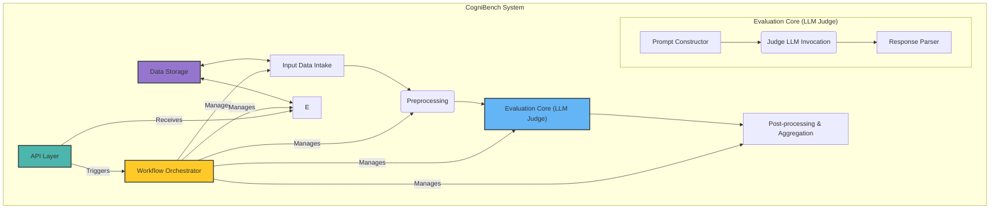

# ⚖️ CogniBench: LLM-as-a-Judge System Architecture for Advanced Math & STE Evaluation 🔍

## 1. Introduction & Goals

* **Purpose:** To create an automated system (CogniBench) that evaluates the quality of Large Language Model (LLM) responses to advanced mathematics and STEM prompts.
* **Core Function:** The system takes a `PROMPT`, the `MODEL RESPONSE` (including step-by-step reasoning and final answer), an `IDEAL RESPONSE` (expert-written detailed steps), and the `CORRECT ANSWER` as input. It outputs a detailed, structured evaluation based on a predefined rubric (the enhanced L1 rubric), assessing the correctness, rigor, and logical soundness of the `MODEL RESPONSE`.
* **Scope:** Primarily focused on the evaluation (`Judge`) component, assuming the `PROMPT`, `MODEL RESPONSE`, `IDEAL RESPONSE`, and `CORRECT ANSWER` are provided externally. CogniBench implements the L1 diagnostic analysis described in the reference document.
* **Target Users:** Internal R&D teams, potentially adapted for client reporting verification.
* **Key Challenge:** Ensuring the LLM judge consistently and accurately applies the nuanced L1 rubric criteria to complex mathematical reasoning.

## 2. Key Concepts (from Reference Document)

* **PROMPT:** The original advanced math/STEM problem.
* **MODEL RESPONSE:** The LLM-generated solution, including reasoning steps and a final answer.
* **IDEAL RESPONSE:** The expert-provided, step-by-step correct solution methodology.
* **CORRECT ANSWER:** The ground-truth final answer to the prompt.
* **CogniBench:** The system being designed; it leverages a powerful LLM (the "Judge LLM") to perform the evaluation.
* **L1 Rubric Parameters:** Problem Understanding, Assumptions, Logical Implications, Results/Formulae, Rigor and Completeness.
* **L2 Subcomponents:** Granular criteria under each L1 parameter.
* **Binary Evaluation (Yes/No):** Each L1 parameter (and potentially L2 subcomponent) is scored as either fully meeting the criteria (Yes) or having a flaw (No).
* **Justification:** The judge must provide reasoning for each Yes/No decision, referencing specific parts of the `MODEL RESPONSE` and `IDEAL RESPONSE`.

## 3. High-Level Architecture

The system follows a pipeline/workflow architecture:

*Note: This diagram represents the core evaluation workflow. Batch processing involves scripts that orchestrate this workflow for multiple inputs.*

## 4. Component Breakdown

* **A. Input Data Intake:**
  * **Function:** Receives evaluation requests containing `PROMPT`, `MODEL RESPONSE`, `IDEAL RESPONSE`, `CORRECT ANSWER`.
  * **Interface:** Likely via an API endpoint or a message queue.
  * **Validation:** Basic checks for presence and format of all required inputs. Stores raw input data in `Data Storage`.
* **B. Preprocessing Module:**
  * **Function:** Prepares inputs for the Judge LLM.
  * **Sub-Tasks:**
    * *Format Normalization:* Ensure text encodings, line breaks, etc., are consistent. Render LaTeX/MathML if present in a canonical way (e.g., plain text representation or consistent image format if visual).
    * *Final Answer Extraction:* Implement logic (regex, heuristics, or a dedicated small LLM call) to reliably extract the explicit `FINAL ANSWER` from the `MODEL RESPONSE`.
    * *(Optional) Response Segmentation:* Attempt to break down `MODEL RESPONSE` and `IDEAL RESPONSE` into logical sections (e.g., problem setup, step 1, step 2, calculation, conclusion). This aids the Judge LLM and human review. Can use heuristics (keywords like "Step 1:", "Therefore", "Let...") or another LLM call.
    * *Sanitization:* Remove potentially harmful content or PII if necessary, depending on deployment context.
* **C. Evaluation Core (LLM Judge):**
  * **Function:** Performs the core evaluation using a powerful Judge LLM based on the L1 rubric.
  * **C1. Prompt Constructor:**
    * Dynamically builds the prompt for the Judge LLM.
    * **Key Contents:**
      * **System Message/Instructions:** Define the role ("You are an expert mathematician evaluating an AI's solution..."), the task (evaluate based on the rubric), the required output format (e.g., JSON with Yes/No and Justification for each L1 parameter).
      * **The L1 Rubric:** Embed the full definition of each L1 parameter and its L2 subcomponents, including the Yes/No criteria and examples of failures.
      * **Input Data:** Include the `PROMPT`, the preprocessed `MODEL RESPONSE`, the preprocessed `IDEAL RESPONSE`, and the `CORRECT ANSWER`. Clearly label each piece.
      * **Specific Instructions:** Guide the LLM to compare `MODEL RESPONSE` against `IDEAL RESPONSE` and the rubric criteria. Explicitly ask for:
        * A Yes/No judgment for each L1 parameter.
        * Detailed justification for each judgment, citing specific evidence from the `MODEL RESPONSE` (and `IDEAL RESPONSE` where relevant).
        * *(Optional)* Yes/No judgments for L2 subcomponents.
        * Identification of specific errors (calculation, logical fallacy, misinterpreted constraint, etc.).
    * **Strategy:** May require multiple sequential prompts (e.g., one prompt per L1 parameter) or a single complex prompt. Experimentation needed. Single complex prompt is often preferred if context window allows, for better holistic understanding.
  * **C2. Judge LLM Invocation:**
    * Sends the constructed prompt to the chosen Judge LLM API (e.g., OpenAI API, Claude API, Gemini API).
    * Handles API parameters (model selection, temperature=0 for consistency, max tokens, potential use of Function Calling/Tool Use or JSON mode).
    * Manages retries and error handling for API calls.
  * **C3. Response Parser:**
    * Receives the raw output from the Judge LLM.
    * Parses the output to extract the structured evaluation data (Yes/No scores, justifications for each L1 parameter).
    * Validates the structure and completeness of the parsed data against the expected format. Handles cases where the LLM fails to adhere to the format.
* **D. Post-processing & Aggregation:**
  * **Function:** Refines and aggregates the raw evaluation results.
  * **Sub-Tasks:**
    * *Final Answer Verification:* Compare the `Extracted Final Answer` (from Preprocessing) with the `CORRECT ANSWER`. This result strongly informs the `Results/Formulae` L1 score but is also a critical standalone metric.
    * *Consistency Checks (Optional):* Implement checks, e.g., if `Results/Formulae` is 'No' due to final answer mismatch, ensure justification aligns. Could involve rule-based checks or even another LLM call for self-consistency review.
    * *Score Aggregation:* Calculate summary statistics if needed (e.g., total L1 'Yes' count). Determine an overall PASS/FAIL based on predefined rules (e.g., requires 'Yes' on all L1 parameters, or specific combinations). The reference doc suggests *any* 'No' results in overall failure for that component.
    * *Human Review Flags:* Identify evaluations that might need human review (e.g., low confidence scores from the LLM if available, inconsistent justifications, borderline cases, failure to parse LLM output).
* **E. Output Generation:**
  * **Function:** Formats the final evaluation into a human-readable and machine-readable report.
  * **Formats:** JSON (primary for downstream processing), Markdown, potentially PDF.
  * **Content:** Include input data references, the extracted final answer vs. correct answer, the detailed L1 (and L2 if captured) rubric scores (Yes/No) with justifications, identified errors, overall assessment (Pass/Fail), and any human review flags. Stores the structured output in `Data Storage`.
* **F. Data Storage:**
  * **Function:** Persists all relevant data for tracking, analysis, auditing, and potential future fine-tuning of the Judge LLM.
  * **Technology:** Primarily uses JSON Lines (`.jsonl`) for efficient appending of evaluation results during runs, stored on the filesystem. Formatted JSON (`.json`) versions are generated for readability, and a final combined JSON aggregates results. Databases (SQL/NoSQL) could be integrated for more complex querying and management.
  * **Structure (Filesystem):**
      * `data/Batch-XXX_YYYYMMDD_HHMM/`: Timestamped subdirectory created by `run_batch_evaluation.py` for each run.
          * `*_ingested_*.json`: Data prepared for evaluation by `ingest_rlhf_data.py`.
          * `*_evaluations.jsonl`: Detailed judge evaluation results for each model response (append-friendly).
          * `*_evaluations_formatted.json`: Pretty-printed JSON array version of the `.jsonl` file (excluding raw judge output).
          * `*_final_results.json`: Final aggregated output, grouping results by `task_id` and combining ingested data (prompt, ideal response, metadata, human evals) with judge evaluations for each model.
      * `logs/CogniBench_YYYYMMDD_HHMM.log`: Timestamped log file containing detailed execution information (DEBUG level and above). Console output is typically limited to WARNING level and above, plus `tqdm` progress bars.
* **G. Workflow Orchestrator:**
  * **Function:** Manages the execution flow of the pipeline steps (A -> B -> C -> D -> E).
  * **Technology:** Python scripts (`scripts/run_batch_evaluation.py`, `run_single_evaluation.py`). `run_batch_evaluation.py` orchestrates the end-to-end process including ingestion and evaluation steps.
  * **Features:** Manages execution flow, handles file paths, calls component scripts (ingestion, evaluation), aggregates final results, manages logging configuration via `core/log_setup.py`.
* **H. API Layer:**
  * **Function:** Provides an external interface to submit evaluation requests and retrieve results.
  * **Technology:** RESTful API using frameworks like FastAPI, Flask (Python), or Node.js/Express.
  * **Endpoints:**
    * `POST /evaluate`: Submit a new evaluation request (Payload: Prompt, Model Response, Ideal Response, Correct Answer). Returns a job ID.
    * `GET /evaluate/{job_id}`: Check the status and retrieve the results of an evaluation.

## 5. Data Flow

1. User/System submits evaluation data via `API Layer`.
2. `API Layer` triggers `Workflow Orchestrator`, passing data to `Input Data Intake`.
3. `Input Data Intake` validates and stores raw data in `Data Storage`, passes data to `Preprocessing`.
4. `Preprocessing` cleans, extracts answer, segments data, passes prepared data to `Evaluation Core`.
5. `Evaluation Core` (`Prompt Constructor` -> `Judge LLM Invocation` -> `Response Parser`) performs the rubric-based assessment, generating raw evaluation results.
6. Raw evaluation passed to `Post-processing & Aggregation`.
7. `Post-processing` verifies final answer, aggregates scores, flags issues, passes final structured data to `Output Generation`.
8. `Output Generation` creates report formats (JSON, MD) and stores them in `Data Storage`.
9. `API Layer` retrieves the final report from `Data Storage` or the orchestrator upon request (`GET /evaluate/{job_id}`).

## 6. Technology Stack Choices (Example)

* **Programming Language:** Python (due to excellent data science, ML/LLM libraries, and web frameworks).
* **LLM Judge:** GPT-4 / GPT-4o, Claude 3 Opus, Gemini 1.5 Pro (choose based on performance, context window, cost, API features like JSON mode/Function Calling).
* **API Framework:** FastAPI or Flask.
* **Workflow Orchestration:** Prefect, Dagster, or AWS Step Functions.
* **Data Storage:** PostgreSQL (for structured data and relational integrity) or MongoDB (if schema flexibility is paramount).
* **Deployment:** Docker containers, orchestrated via Kubernetes or deployed on cloud platforms (AWS, GCP, Azure) using services like SageMaker, Vertex AI, Azure ML, or container services (ECS, EKS, GKE, AKS).

## 7. Key Design Considerations & Trade-offs

* **Prompt Engineering:** *Critical Path.* Requires iterative refinement. Prompts must be unambiguous, include the full rubric, and clearly specify the desired output format. Consider using Few-Shot examples within the prompt.
* **Judge LLM Choice:** Stronger models (GPT-4o, Opus) yield better reasoning but are slower/more expensive. Need to balance quality vs. cost/latency.
* **Structured Output:** Relying on LLMs for structured output (JSON) is crucial but not foolproof. Implement robust parsing and validation. Function Calling/Tool Use can improve reliability.
* **Consistency:** LLM outputs can vary. Use `temperature=0`. Consider running evaluations multiple times (e.g., 2 out of 3 agreement) for critical assessments, although this increases cost.
* **Human-in-the-Loop:** *Essential.* Implement a review interface for experts to validate/correct Judge LLM outputs, especially during initial calibration and for ambiguous cases. This feedback loop is crucial for improving prompts and potentially fine-tuning the judge model in the future.
* **Scalability:** Design for asynchronous processing using the orchestrator and potentially scale Judge LLM invocations horizontally.
* **Context Window Limitations:** Advanced math solutions can be long. Ensure the Judge LLM has a sufficient context window. If not, strategies like breaking down the evaluation per step or using abstracted summaries might be needed (but risk losing fidelity).
* **Cost Management:** Monitor LLM API usage closely. Explore caching identical requests (if applicable). Potentially use smaller/cheaper models for simpler preprocessing tasks (like answer extraction).
* **Rubric Evolution:** Design the system (especially prompt construction and parsing) to be adaptable if the L1/L2 rubric needs modification later. Store the rubric version used for each evaluation.
* **Security:** If handling sensitive/proprietary prompts or model outputs, ensure appropriate data handling, access controls, and potentially use models with stronger data privacy guarantees (e.g., Azure OpenAI).

## 8. Deployment Strategy (Initial)

1. Develop locally using Docker containers for each service.
2. Deploy to a cloud environment (e.g., AWS).
    * API Layer -> API Gateway + Lambda/ECS/EKS.
    * Workflow Orchestrator -> Step Functions / Managed Prefect/Airflow / ECS/EKS.
    * Data Storage -> RDS (PostgreSQL) / DocumentDB (MongoDB).
    * LLM Calls -> Direct API calls to OpenAI/Anthropic/Google.
3. Implement CI/CD pipelines for automated testing and deployment.
4. Set up monitoring and logging (e.g., CloudWatch, Datadog).

## 9. Future Enhancements

* **Fine-tuning the Judge LLM:** Use human-corrected evaluations as training data to fine-tune a base LLM for the specific task of rubric-based math evaluation within CogniBench, potentially improving accuracy and consistency.
* **Multi-Judge Consensus:** Employ multiple different Judge LLMs within CogniBench and aggregate their results for higher confidence.
* **Visual Understanding:** Integrate capabilities into CogniBench to analyze diagrams or plots if they are part of the prompt or response (requires multi-modal models).
* **Automated Ideal Response Generation (Research):** Explore using powerful LLMs within the CogniBench workflow to *generate* the `IDEAL RESPONSE` as a starting point for human experts, speeding up the process.
* **Integration with L0:** Tightly integrate the L1 Judge output from CogniBench back into the L0 Golden Prompt Discovery process for richer failure analysis.
* **User Interface:** Build a simple web UI for CogniBench for submitting evaluations and viewing reports, including side-by-side comparison of Model vs. Ideal response annotated with judge comments.
