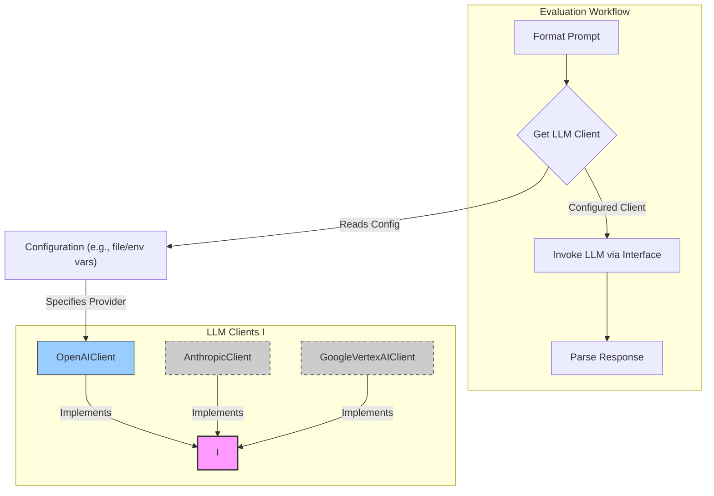

# 🚧 CogniBench Implementation Roadmap

## Overall Goal

To implement the CogniBench system as defined in the architecture document, enabling reliable, rubric-based evaluation of LLM responses for advanced Math/STEM problems, incorporating iterative feedback and human oversight.

## Prerequisites

1. **Team:** Defined roles (e.g., Backend Dev, ML/Prompt Engineer, Domain Expert/Reviewer, DevOps).
2. **Tools:** Development environment, version control (Git), project management tool.
3. **LLM Access:** API keys and budget allocated for the chosen Judge LLM (e.g., GPT-4o, Claude 3 Opus).
4. **Initial Rubric Definition:** The detailed L1/L2 rubric (as provided) is finalized and version-controlled.
5. **Sample Data:** A small set of `PROMPT`, `MODEL RESPONSE`, `IDEAL RESPONSE`, `CORRECT ANSWER` examples for initial testing.

## Phase 1: Core Evaluation Engine Mechanics & MVP

* **Goal:** Build the absolute minimum viable product to prove the *core mechanics* of the evaluation logic. Focus on getting *one or two key rubric criteria* processed end-to-end via manual trigger, ensuring reliable LLM interaction and structured output parsing.
* **Key Activities:**
    1. **Setup Data Storage (F - Basic):** Define clear structures for JSON files (e.g., `data/prompts.json`, `data/model_responses.json`, `data/ideal_responses.json`, `data/evaluations.json`) to store inputs and structured evaluation outputs. Focus on essential fields. *Design the JSON structure from the start to accommodate fields for potential human review feedback (e.g., corrected scores, comments) even if the UI comes later.*
    2. **Implement Input Intake (A - Manual):** Create scripts to manually load sample data (PROMPT, MODEL_RESPONSE, etc.) into the defined JSON files.
    3. **Develop Evaluation Core (C - V1):**
        * **Prompt Constructor (C1):** Create the initial prompt template incorporating the *selected initial L1 rubric criteria*, instructions, and placeholders for input data. Embed the rubric text directly. Focus on clarity and requesting structured JSON output for the targeted criteria.
        * **LLM Invocation (C2):** Implement reliable API calls to the chosen Judge LLM (handle basic errors, retries, set `temperature=0`).
        * **Response Parser (C3):** Parse the expected JSON output from the Judge LLM. Implement basic validation to check if the structure matches expectations (selected L1 parameters present with Yes/No and justification). Handle simple parsing errors.
    4. **Implement Output Generation (E - Basic):** Append the parsed evaluation results (initial L1 scores + justifications) to the `evaluations.json` file (or a dedicated output file per run). Log results to console/file.
    5. **Basic Test Harness:** Create scripts to run a single evaluation instance using sample data and verify the output structure for the targeted criteria.
* **Deliverables:**
  * Defined JSON file structures (including fields for future human feedback).
  * Scripts to load sample data.
  * Functional `Evaluation Core` capable of processing one sample for *initial rubric criteria* via Judge LLM API call.
  * Structured evaluation results stored in JSON files and logged.
  * Initial version-controlled prompt template.
  * *Explicit tests validating LLM output structure and basic parsing for the targeted criteria.*
* **Key Focus:** Proving LLM API interaction mechanics, structured data handling, initial prompt engineering for limited criteria.

## Phase 2: Workflow Automation & Data Enrichment + Early Feedback

* **Goal:** Automate the end-to-end evaluation flow using an orchestrator, enrich the data handling/processing steps, and introduce an early human feedback mechanism.
* **Key Activities:**
    1. **Implement Workflow Orchestrator (G - V1):** Choose and set up an orchestrator (e.g., Prefect, Dagster, simple Python `asyncio` scripts). Define a workflow that chains the steps: Intake -> Preprocessing -> Evaluation -> Post-processing -> Output.
    2. **Develop Preprocessing Module (B):**
        * Implement robust `Final Answer Extraction` logic (*consider specialized tools like SymPy or dedicated LLM calls alongside heuristics*).
        * Implement `Format Normalization` (text cleaning, potentially basic LaTeX handling).
        * *(Optional)* Implement initial `Response Segmentation` heuristics.
    3. **Develop Post-processing & Aggregation Module (D - V1):**
        * Implement automated `Final Answer Verification` (compare extracted answer vs. correct answer).
        * Implement basic `Score Aggregation` (e.g., count 'Yes' scores, determine overall Pass/Fail based on simple rules like "All Yes = Pass" *once full rubric coverage is achieved*).
        * Store aggregated results alongside detailed rubric scores.
    4. **Refine Data Storage (F):** Refine JSON file structures as needed to accommodate pre/post-processing outputs (extracted answer, segmentation info, aggregated scores). Ensure consistent use of IDs for linking data across files.
    5. **Integrate Components:** Connect modules A, B, C, D, E under the management of the Orchestrator (G). *Expand Evaluation Core (C) to cover more/all L1 rubric criteria.*
    6. **Error Handling & Logging:** Implement more robust error handling within the workflow (e.g., failed LLM calls, parsing errors) and centralized logging.
    7. **Implement Lightweight Human Review Process:** Define a simple process (e.g., reviewing structured logs or entries in the JSON files) for domain experts to provide early feedback on Judge LLM outputs. Store this feedback using the JSON structures defined in Phase 1.
* **Deliverables:**
  * Automated workflow managed by the orchestrator.
  * Functional Preprocessing module.
  * Functional Post-processing module with answer verification and basic aggregation.
  * Updated JSON file structures storing richer evaluation data.
  * Improved logging and error handling for the core workflow.
  * *Basic process and mechanism for capturing early human review feedback.*
  * *Evaluation Core expanded to cover more/all L1 criteria.*
  * *Tests verifying the end-to-end data flow through the automated workflow.*
* **Key Focus:** Workflow automation, data flow integrity, enhancing core processing steps, enabling early human feedback loop.

## Phase 3: API Integration & Basic Usability

* **Goal:** Expose CogniBench functionality via an API and improve output formatting for users.
* **Key Activities:**
    1. **Implement API Layer (H):**
        * Develop RESTful API endpoints (`POST /evaluate`, `GET /evaluate/{job_id}`) using FastAPI/Flask.
        * Implement request validation.
        * Integrate `POST /evaluate` to trigger the workflow via the Orchestrator (G).
        * Implement `GET /evaluate/{job_id}` to retrieve status and results by reading from the relevant JSON files (Data Storage F).
    2. **Refine Output Generation (E):**
        * Ensure the API returns well-formatted JSON responses.
        * *(Optional)* Add functionality to generate simple Markdown reports summarizing the evaluation.
    3. **Authentication & Authorization (Basic):** Implement basic API key authentication.
    4. **Monitoring (Basic):** Set up basic monitoring for API endpoints and workflow execution status.
* **Deliverables:**
  * Functional REST API for submitting evaluations and retrieving results.
  * API integrated with the backend workflow orchestrator.
  * Improved output formats (structured JSON via API, optional Markdown).
  * Basic API authentication and monitoring.
  * *API contract tests and basic integration tests.*
* **Key Focus:** External system integration, usability via API, basic security and monitoring.

## Phase 4: Enhancement, Robustness & Formal Human Review Loop

* **Goal:** Improve the quality and reliability of evaluations, add formal mechanisms for human oversight, and prepare for deployment.
* **Key Activities:**
    1. **Prompt Engineering Iteration:** Based on results and *human feedback* from Phases 1-3, refine the Judge LLM prompts for better accuracy, consistency, and adherence to the full rubric. Experiment with few-shot examples, clearer instructions, or breaking down the evaluation task within the prompt. *Consider externalizing prompt templates (e.g., config files) for easier management and configurability (allowing switching between single vs. multi-prompt strategies).*
    2. **Improve Response Parsing (C3):** Handle more edge cases and potential deviations in the LLM's output format gracefully. Add fallback logic or retry mechanisms if parsing fails.
    3. **Enhance Post-processing (D):** Implement `Consistency Checks` (e.g., does justification align with score?). Add logic to flag evaluations needing human review based on inconsistencies, low confidence (if LLM provides it), or specific error patterns.
    4. **Develop Formal Human Review Interface/Process:**
        * Design a *more robust* process for domain experts to review flagged or sampled evaluations efficiently.
        * Build a simple internal tool/interface (or leverage scripts/tools to query/update JSON files) *allowing reviewers to easily see `PROMPT`, `MODEL RESPONSE`, `IDEAL RESPONSE`, `LLM Judge Output` side-by-side and override/correct the Judge's assessment.*
        * Ensure human corrections/feedback are stored effectively in the JSON files.
    5. **Containerization:** Dockerize all system components (API, Orchestrator workers).
    6. **Testing:** Implement more comprehensive unit, integration, and end-to-end tests. Test with a wider variety of challenging prompts. *Add tests for human review flagging logic and feedback storage.*
* **Deliverables:**
  * Refined and version-controlled prompt templates (potentially externalized).
  * More robust LLM response parsing.
  * Enhanced post-processing with flagging for human review.
  * A defined *formal* process and basic tooling for human review and correction.
  * Mechanism to store human feedback/overrides effectively.
  * Dockerized application components.
  * Improved test suite coverage.
* **Key Focus:** Evaluation quality, reliability, establishing efficient human oversight, deployment readiness.

## Phase 5: Scalability, Advanced Features & Production Deployment

* **Goal:** Optimize the system for performance, cost, and scalability; deploy to a production environment; explore advanced features.
* **Key Activities:**
    1. **Performance & Cost Optimization:**
        * Analyze LLM API usage and costs. Explore caching strategies.
        * Potentially experiment with smaller/cheaper LLMs for specific tasks (e.g., answer extraction) if feasible without sacrificing quality.
        * Optimize JSON file reading/writing operations and workflow execution time.
    2. **Scalability:** Configure horizontal scaling for API layer and workflow workers (especially LLM invocation tasks) using cloud services or Kubernetes.
    3. **Deployment:** Deploy the containerized application to the target production environment (e.g., AWS/GCP/Azure using EKS/GKE/AKS or managed services).
    4. **CI/CD:** Implement full CI/CD pipelines for automated testing and deployment.
    5. **Advanced Monitoring & Alerting:** Set up detailed monitoring dashboards and alerts for system health, performance, costs, and evaluation quality metrics.
    6. **Advanced Features (Exploratory/Optional):**
        * Develop a more sophisticated Web UI for submission, reporting, and human review.
        * Experiment with fine-tuning a dedicated Judge LLM using human-corrected data.
        * Implement multi-judge consensus logic.
        * Integrate visual understanding capabilities (if needed).
* **Deliverables:**
  * Scalable and optimized system deployed to production.
  * CI/CD pipelines in place.
  * Comprehensive monitoring and alerting.
  * (Optional) Prototypes or implementations of advanced features.
* **Key Focus:** Production readiness, operational excellence, cost efficiency, future R&D.

## Cross-Cutting Concerns (Throughout All Phases)

* **Documentation:** Maintain up-to-date documentation for architecture, APIs, setup, and processes.
* **Testing:** Continuously write and update tests at all levels (unit, integration, end-to-end). *Ensure phase-specific testing goals are met.*
* **Security:** Apply security best practices (API keys management, input sanitization, infra security).
* **Cost Management:** Track LLM API costs and infrastructure expenses from the beginning.
* **Human Feedback Loop:** Regularly involve domain experts to review results, refine the rubric, and provide feedback on the Judge LLM's performance, feeding improvements back into prompt engineering or future fine-tuning efforts. *Leverage the early feedback mechanism from Phase 2 onwards.*
* **Version Control:** Use Git diligently for code, prompts, and potentially rubric definitions.

This phased plan allows for incremental progress, frequent feedback loops (especially with human reviewers), and adaptation as challenges arise during development.

